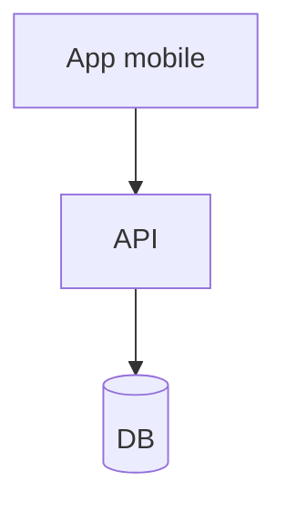

# Skill — ailed-architecture-map

## Objectif
Générer / mettre à jour la cartographie d'architecture (diagrammes Mermaid) dans
`memory/architecture.md`.

## Paramètres
- `scope` : applicatif | infrastructure | données | intégrations.

## Comportement
- Inspecte le code et la configuration existants.
- Produit ou met à jour un diagramme Mermaid correspondant.
- Signale les zones inconnues.

## Exemple

## Artefacts mis à jour
`memory/architecture.md`.
