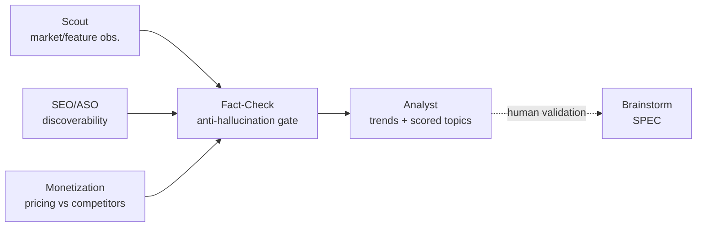
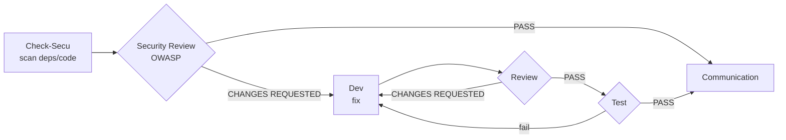

# Process & Workflows

Last Updated: {{DATE}}

Describes the agent-driven workflows. Each step consumes the artefacts of the previous one (constitution rule 9). Maintained by the AI-Led framework.

## Principles

- No development without a ticket; no ticket without a human-validated SPEC.
- Each agent has defined inputs/outputs (see `.claude/agents/`).
- The Step 8 quality gates must be green before closing a ticket.

---

## Memory rotation (append-only files)

`incidents.md`, `decisions.md` and `market-watch.md` grow unbounded: every agent read gets
more expensive over time. To keep reads light, they are **split into active + archive**:

- Keep **inline** only the active entries: open or < 90-day incidents, ADRs still in force,
  market-watch observations < 6 months old and not dropped.
- Move the rest to `memory/archive/<file>.md` (same name, created on demand), and leave a
  `> Archives: memory/archive/<file>.md` line at the top of the active file.
- Agents read **only the active file**; the archive is opened solely for explicit historical
  investigation.
- Archiving happens **incrementally** by the maintaining agent, when it edits the file
  (nothing is ever deleted, only moved).

---

## Discovery workflow

`(Scout · SEO/ASO · Monetization) → Fact-Check → Analyst → [human validation] → Brainstorm (entry to Feature workflow)`



`@ailed-scout`, `@ailed-seo-aso` and `@ailed-monetization` are **specialist collectors**
feeding the same "Raw observations"; `@ailed-analyst` remains the only agent that merges
these signals into a **single scored backlog**.

An **exploratory** workflow feeding `memory/market-watch.md` (competitive intelligence).
It **never creates** a ticket or roadmap entry: it produces a scored **candidate topics
backlog**. A human promotes a topic (`candidate` → `validated→brainstorm`), which then
**joins the Feature workflow** via `@ailed-brainstorm`. Disabled while the **Watch**
integration is set to `{{DISABLED}}` in `config.md`.

**Human validation point**: after `Analyst` (promotion of a candidate topic).

> Continuous-improvement loop: `Scout → Fact-Check → Analyst` can be re-run on a cadence
> (e.g. monthly) to refresh the watch and propose a new shortlist. **Discovery** runs in a
> loop; **promotion to roadmap and deployment remain a human decision**.

---

## Feature workflow

`Brainstorm → UX → PM → Architect → Planner → Dev → Review → Test → Communication → Release`

```mermaid
flowchart LR
    BS[Brainstorm<br/>SPEC] --> UX[UX<br/>wireframes]
    UX --> PM[PM<br/>EPIC + roadmap]
    PM --> AR[Architect<br/>ADR]
    AR --> PL[Planner<br/>tickets {{TICKET_PREFIX}}-*]
    PL --> DEV[Dev<br/>branch + MR]
    DEV --> RV{Review}
    RV -- CHANGES REQUESTED --> DEV
    RV -- PASS --> TS{Test<br/>{{E2E}}}
    TS -- fail --> DEV
    TS -- PASS --> CO[Communication<br/>changelog]
    CO --> RL[Release<br/>tag]
    UX -. human validation .-> PM
```

**Human validation points**: after `Brainstorm` (SPEC), after `UX` (mockup),
before `Release`.

---

## Incident workflow

`Check-Log → RCA → Dev → Review → Test → Communication`

```mermaid
flowchart LR
    CL[Check-Log<br/>{{MONITORING}} 24h] --> RCA[RCA<br/>root cause]
    RCA --> DEV[Dev<br/>fix fix/*]
    DEV --> RV{Review}
    RV -- CHANGES REQUESTED --> DEV
    RV -- PASS --> TS{Test}
    TS -- fail --> DEV
    TS -- PASS --> CO[Communication<br/>incidents.md]
```

---

## Security workflow

`Check-Secu → Security Review → Dev → Review → Test → Communication`



Only `CRITICAL` and `HIGH` vulnerabilities automatically trigger a ticket and entry into this workflow.
