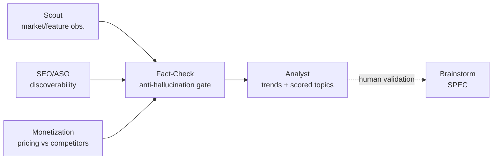
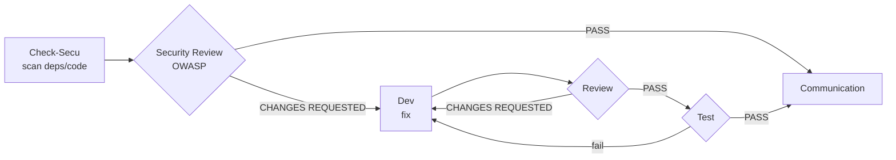

# Process & Workflows

Last Updated: {{DATE}}

Describes the agent-driven workflows. Each step consumes the artefacts of the previous one (constitution rule 9). Maintained by the AI-Led framework.

## Principles

- No development without a ticket; no ticket without a human-validated SPEC.
- Each agent has defined inputs/outputs (see `.claude/agents/`).
- The Step 8 quality gates must be green before closing a ticket.

---

## Memory rotation & cleanup

Several files grow unbounded: every agent read gets more expensive **in tokens** over time. To
keep reads light, only the **active entries stay inline**; the rest is archived (same name under
`memory/archive/`, created on demand), with a `> Archives: memory/archive/<file>.md` line at the
top of the active file.

Principle: **nothing is ever deleted, only moved.** Agents read **only the active file**; the
archive is opened solely for explicit historical investigation.

| File | Stays inline (active) | Moved to archive |
| ---- | --------------------- | ---------------- |
| `kanban.md` | live tickets (`TO_CHECK`→`TO_TEST`) + `DONE` not yet shipped in a release | shipped `DONE` tickets **whose functionality is captured in `features.md`** |
| `incidents.md` | open incidents or closed < 90 days ago | the rest |
| `decisions.md` | ADRs still in force | superseded / obsolete ADRs |
| `market-watch.md` | observations < 6 months old and not dropped | the rest |

**Triggers** (so archiving actually happens, never left to chance):

- **Incrementally**: the maintaining agent archives as soon as it edits the file and an entry
  flips from "active" to "archivable".
- **Size threshold**: once a file exceeds **~40 active entries** (table rows / blocks), the agent
  touching it **must** archive the overflow **before** writing — the threshold makes cleanup
  deterministic rather than reliant on vigilance.
- **Kanban at release**: `@ailed-release` **archives the shipped `DONE` tickets to
  `memory/archive/kanban.md`**, but **only once it has verified that `features.md` reflects the
  delivered functionality** (otherwise the ticket stays inline: no information is ever lost before
  it is captured elsewhere). `features.md` is the **durable record of what shipped**;
  `archive/kanban.md` only keeps the raw ticket→MR→date history.

---

## Session hygiene (cost & context)

Since `memory/` is the **source of truth**, the conversation does not need to hold everything.
Long sessions cost tokens *even when cached* — hence a few rules:

- **One unit of work = one session.** A dev ticket, an incident, a watch pass each run in a
  clean session; reload the useful context from `memory/` at startup instead of dragging along
  a history that keeps growing.
- **`/clear` at boundaries.** When a workflow ends (capstone) or an MR is opened, the
  `ailed-runtime-hook.js` hook suggests `/clear`: following it resets the context with no loss
  (state lives in `memory/`).
- **`/compact` mid-task** if a single session grows long, to condense without starting over.
- Agents never rely on "what was said above" for a durable fact: they write it to `memory/`
  and read it back.

---

## Discovery workflow

`(Scout · SEO/ASO · Monetization) → Fact-Check → Analyst → [human validation] → Brainstorm (entry to Feature workflow)`



`@ailed-scout`, `@ailed-seo-aso` and `@ailed-monetization` are **specialist collectors**
feeding the same "Raw observations"; `@ailed-analyst` remains the only agent that merges
these signals into a **single scored backlog**.

An **exploratory** workflow feeding `memory/market-watch.md` (competitive intelligence).
It **never creates** a ticket or roadmap entry: it produces a scored **candidate topics
backlog**. A human promotes a topic (`candidate` → `validated→brainstorm`), which then
**joins the Feature workflow** via `@ailed-brainstorm`. Disabled while the **Watch**
integration is set to `{{DISABLED}}` in `config.md`.

**Human validation point**: after `Analyst` (promotion of a candidate topic).

> Continuous-improvement loop: `Scout → Fact-Check → Analyst` can be re-run on a cadence
> (e.g. monthly) to refresh the watch and propose a new shortlist. **Discovery** runs in a
> loop; **promotion to roadmap and deployment remain a human decision**.

---

## Feature workflow

`Brainstorm → UX → PM → Architect → Planner → Dev → Review → Test → Communication → Release`

```mermaid
flowchart LR
    BS[Brainstorm<br/>SPEC] --> UX[UX<br/>wireframes]
    UX --> PM[PM<br/>EPIC + roadmap]
    PM --> AR[Architect<br/>ADR]
    AR --> PL[Planner<br/>tickets {{TICKET_PREFIX}}-*]
    PL --> DEV[Dev<br/>branch + MR]
    DEV --> RV{Review}
    RV -- CHANGES REQUESTED --> DEV
    RV -- PASS --> TS{Test<br/>{{E2E}}}
    TS -- fail --> DEV
    TS -- PASS --> CO[Communication<br/>changelog]
    CO --> RL[Release<br/>tag]
    UX -. human validation .-> PM
```

**Human validation points**: after `Brainstorm` (SPEC), after `UX` (mockup),
before `Release`.

---

## Incident workflow

`Check-Log → RCA → Dev → Review → Test → Communication`

```mermaid
flowchart LR
    CL[Check-Log<br/>{{MONITORING}} 24h] --> RCA[RCA<br/>root cause]
    RCA --> DEV[Dev<br/>fix fix/*]
    DEV --> RV{Review}
    RV -- CHANGES REQUESTED --> DEV
    RV -- PASS --> TS{Test}
    TS -- fail --> DEV
    TS -- PASS --> CO[Communication<br/>incidents.md]
```

---

## Security workflow

`Check-Secu → Security Review → Dev → Review → Test → Communication`



Only `CRITICAL` and `HIGH` vulnerabilities automatically trigger a ticket and entry into this workflow.
