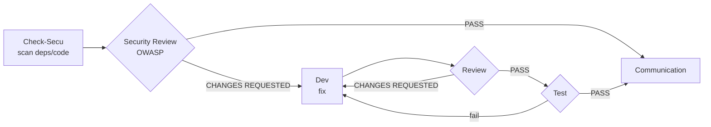

# Process & Workflows

Last Updated: YYYY-MM-DD

Describes the agent-driven workflows. Each step consumes the artefacts of the previous one (constitution rule 9). Maintained by the AI-Led framework.

## Principles

- No development without a ticket; no ticket without a human-validated SPEC.
- Each agent has defined inputs/outputs (see `.claude/agents/`).
- The Step 8 quality gates must be green before closing a ticket.

---

## Feature workflow

`Brainstorm → UX → PM → Architect → Planner → Dev → Review → Test → Communication → Release`

```mermaid
flowchart LR
    BS[Brainstorm<br/>SPEC] --> UX[UX<br/>wireframes]
    UX --> PM[PM<br/>EPIC + roadmap]
    PM --> AR[Architect<br/>ADR]
    AR --> PL[Planner<br/>tickets {{TICKET_PREFIX}}-*]
    PL --> DEV[Dev<br/>branch + MR]
    DEV --> RV{Review}
    RV -- CHANGES REQUESTED --> DEV
    RV -- PASS --> TS{Test<br/>{{E2E}}}
    TS -- fail --> DEV
    TS -- PASS --> CO[Communication<br/>changelog]
    CO --> RL[Release<br/>tag]
    UX -. human validation .-> PM
```

**Human validation points**: after `Brainstorm` (SPEC), after `UX` (mockup),
before `Release`.

---

## Incident workflow

`Check-Log → RCA → Dev → Review → Test → Communication`

```mermaid
flowchart LR
    CL[Check-Log<br/>{{MONITORING}} 24h] --> RCA[RCA<br/>root cause]
    RCA --> DEV[Dev<br/>fix fix/*]
    DEV --> RV{Review}
    RV -- CHANGES REQUESTED --> DEV
    RV -- PASS --> TS{Test}
    TS -- fail --> DEV
    TS -- PASS --> CO[Communication<br/>incidents.md]
```

---

## Security workflow

`Check-Secu → Security Review → Dev → Review → Test → Communication`



Only `CRITICAL` and `HIGH` vulnerabilities automatically trigger a ticket and entry into this workflow.
