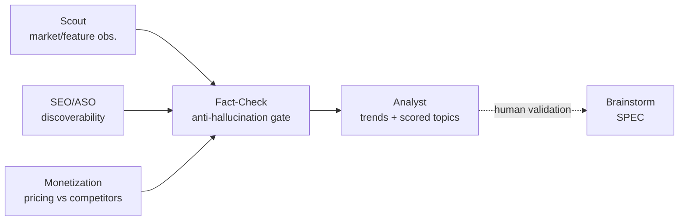
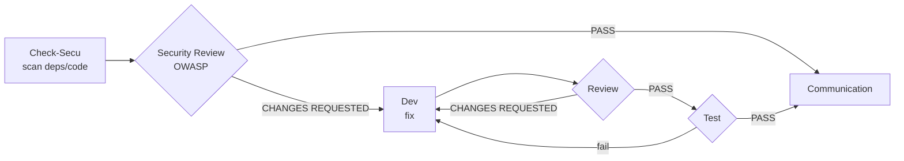

# Process & Workflows

Last Updated: {{DATE}}

Describes the agent-driven workflows. Each step consumes the artefacts of the previous one (constitution rule 9). Maintained by the AI-Led framework.

## Principles

- No development without a ticket; no ticket without a human-validated SPEC.
- **No agent creates work outside its mission** (see § "Unrequested findings").
- Each agent has defined inputs/outputs (see `.claude/agents/`).
- The Step 8 quality gates must be green before closing a ticket.

---

## Unrequested findings

A working agent sees things: debt, a minor bug, an improvement idea, a documentation gap.
Turning them into tickets looks rigorous. In practice the backlog becomes unreadable.
The decision to do the work belongs to a human, and it ends up making itself.

**Rule**: a finding outside your mission does not become a ticket. It goes to
`memory/observations.md`, with its severity and its source.

| Finding | Destination |
| ------- | ----------- |
| Explicitly requested by a human | `memory/kanban.md` |
| `CRITICAL` or `HIGH` severity | `memory/kanban.md` **and** `memory/observations.md` |
| Everything else | `memory/observations.md` **only** |

This is exactly the pattern already applied to market watch: `@ailed-scout` collects widely
into `market-watch.md`, and **only a human promotes** a topic into the Feature workflow. The
technical side now follows the same discipline. An agent **proposes** a promotion; it does
not decide it.

An `open` observation older than **90 days** turns `stale`. Nobody judged it important
enough in three months, which is an answer.

---

## Memory rotation & cleanup

Four files grow unbounded: `kanban.md`, `incidents.md`, `decisions.md` and `market-watch.md`.
Every agent read then costs more tokens. To keep reads light, the active file keeps **only the
active entries**. The rest moves to `memory/archive/<same name>.md`, created on demand. The
active file then carries a `> Archives: memory/archive/<file>.md` line at the top.

Principle: **nothing disappears, everything moves.** Agents read **only the active file**.
The archive opens for one reason only: an explicit historical investigation.

| File | Stays inline (active) | Moved to archive |
| ---- | --------------------- | ---------------- |
| `kanban.md` | live tickets (`TO_CHECK`→`TO_TEST`) + `DONE` not yet shipped in a release | shipped `DONE` tickets **whose functionality is captured in `features.md`** |
| `incidents.md` | open incidents or closed < 90 days ago | the rest |
| `decisions.md` | ADRs still in force | superseded / obsolete ADRs |
| `market-watch.md` | observations < 6 months old and not dropped | the rest |
| `observations.md` | `open` and `promoted` findings | `dropped` and `stale` |

**Triggers** (so archiving actually happens, never left to chance):

- **Incrementally**: the maintaining agent archives as soon as it edits the file and an entry
  flips from "active" to "archivable".
- **Volume threshold**: once a file exceeds **40 active entries** *or* its byte budget, the
  agent touching it archives the overflow **before** writing. Counting entries alone is not
  enough: 85 tickets whose every row is an essay weigh 300 kilobytes, below the 40-entry
  mark. Budgets: `kanban.md` 120 kilobytes · `decisions.md` 80 · `epics.md` 60 · others 60.
  `npx @s2bp/ai-led-framework doctor` checks them.
- **Weight of a cell**: a `kanban.md` cell holds **{{MAX_CELL_BYTES}} bytes at most**. A row
  legitimately carries a description, a scope and its acceptance criteria; what goes wrong is
  **one cell turning into an essay**. The detail (analysis, inventory, test protocol) lives in
  `memory/specs/` and the cell links to it.
- **Prose share**: `kanban.md` is a table, not a journal. EPIC narratives, review reports and
  dated comments belong in `memory/specs/` or in the archive. Past **40 %** of the file outside
  table rows, `doctor` says so. An update is made **in place**: fix the cell, do not pile one
  more dated comment under the table.
- **Dedicated command**: `npx @s2bp/ai-led-framework archive` moves finished tickets to the
  archive (dry-run by default, `--apply` to write). Archiving no longer depends on an agent's
  vigilance alone.
- **Kanban at release**: `@ailed-release` **archives the shipped `DONE` tickets to
  `memory/archive/kanban.md`**, but **only once it has verified that `features.md` reflects the
  delivered functionality**. Otherwise the ticket stays inline: the framework never loses an
  information before another file records it. `features.md` is the **durable record of what shipped**;
  `archive/kanban.md` only keeps the raw ticket→MR→date history.

---

## Session hygiene (cost & context)

Since `memory/` is the **source of truth**, the conversation does not need to hold everything.
Long sessions cost tokens *even when cached* — hence a few rules:

- **One unit of work = one session.** A dev ticket, an incident, a watch pass each run in a
  clean session; reload the useful context from `memory/` at startup instead of dragging along
  a history that keeps growing.
- **`/clear` at boundaries.** When a workflow ends (capstone) or a dev opens an MR, the
  `ailed-runtime-hook.js` hook suggests `/clear`: following it resets the context with no loss
  (state lives in `memory/`).
- **`/compact` mid-task** if a single session grows long, to condense without starting over.
- Agents never rely on "what was said above" for a durable fact: they write it to `memory/`
  and read it back.

---

## Discovery workflow

`(Scout · SEO/ASO · Monetization) → Fact-Check → Analyst → [human validation] → Brainstorm (entry to Feature workflow)`



`@ailed-scout`, `@ailed-seo-aso` and `@ailed-monetization` are **specialist collectors**
feeding the same "Raw observations"; `@ailed-analyst` remains the only agent that merges
these signals into a **single scored backlog**.

An **exploratory** workflow feeding `memory/market-watch.md` (competitive intelligence).
It **never creates** a ticket or roadmap entry: it produces a scored **candidate topics
backlog**. A human promotes a topic (`candidate` → `validated→brainstorm`), which then
**joins the Feature workflow** via `@ailed-brainstorm`. Disabled while the **Watch**
integration is set to `{{DISABLED}}` in `config.md`.

**Human validation point**: after `Analyst` (promotion of a candidate topic).

> Continuous-improvement loop: `Scout → Fact-Check → Analyst` can be re-run on a cadence
> (e.g. monthly) to refresh the watch and propose a new shortlist. **Discovery** runs in a
> loop; **promotion to roadmap and deployment remain a human decision**.

---

## Feature workflow

`Brainstorm → UX → PM → Architect → Planner → Dev → Review → Test → Communication → Release`

```mermaid
flowchart LR
    BS[Brainstorm<br/>SPEC] --> UX[UX<br/>wireframes]
    UX --> PM[PM<br/>EPIC + roadmap]
    PM --> AR[Architect<br/>ADR]
    AR --> PL[Planner<br/>tickets {{TICKET_PREFIX}}-*]
    PL --> DEV[Dev<br/>branch + MR]
    DEV --> RV{Review}
    RV -- CHANGES REQUESTED --> DEV
    RV -- PASS --> TS{Test<br/>{{E2E}}}
    TS -- fail --> DEV
    TS -- PASS --> CO[Communication<br/>changelog]
    CO --> RL[Release<br/>tag]
    UX -. human validation .-> PM
```

**Human validation points**: after `Brainstorm` (SPEC), after `UX` (mockup),
before `Release`.

---

## Incident workflow

`Check-Log → RCA → Dev → Review → Test → Communication`

```mermaid
flowchart LR
    CL[Check-Log<br/>{{MONITORING}} 24h] --> RCA[RCA<br/>root cause]
    RCA --> DEV[Dev<br/>fix fix/*]
    DEV --> RV{Review}
    RV -- CHANGES REQUESTED --> DEV
    RV -- PASS --> TS{Test}
    TS -- fail --> DEV
    TS -- PASS --> CO[Communication<br/>incidents.md]
```

---

## Security workflow

`Check-Secu → Security Review → Dev → Review → Test → Communication`



Only `CRITICAL` and `HIGH` vulnerabilities automatically trigger a ticket and entry into this workflow.
