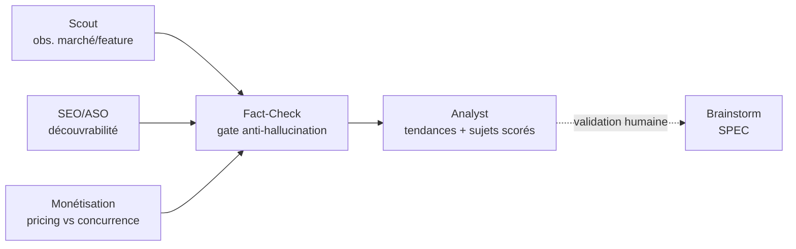
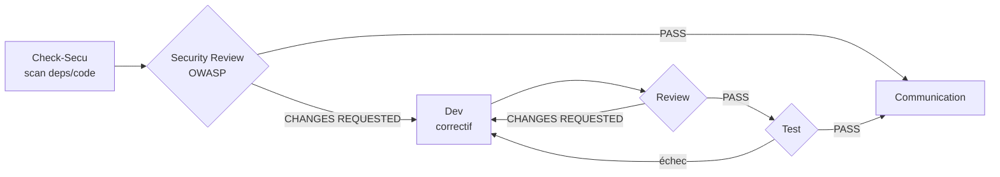

# Processus & Workflows

Last Updated: {{DATE}}

Décrit les workflows pilotés par agents. Chaque étape consomme les artefacts de la précédente (constitution règle 9). Maintenu par le framework AI-Led.

## Principes

- Aucun développement sans ticket ; aucun ticket sans SPEC validée par un humain.
- Chaque agent a des entrées/sorties définies (voir `.claude/agents/`).
- Les quality gates de l'Étape 8 doivent être verts avant clôture d'un ticket.

---

## Rotation & nettoyage de la mémoire

Plusieurs fichiers grossissent sans limite : chaque lecture par un agent devient plus coûteuse
**en tokens**. Pour garder les lectures légères, on ne conserve **inline que les entrées
actives** ; le reste part en archive (même nom sous `memory/archive/`, créé à la demande), avec
en tête du fichier actif une ligne `> Archives : memory/archive/<fichier>.md`.

Principe : **rien n'est jamais supprimé, seulement déplacé.** Les agents lisent **uniquement le
fichier actif** ; l'archive n'est ouverte que pour une investigation historique explicite.

| Fichier | Reste inline (actif) | Part en archive |
| ------- | -------------------- | --------------- |
| `kanban.md` | tickets vivants (`TO_CHECK`→`TO_TEST`) + `DONE` pas encore livrés en release | tickets `DONE` livrés **dont la fonctionnalité est captée dans `features.md`** |
| `incidents.md` | incidents ouverts ou clôturés < 90 j | le reste |
| `decisions.md` | ADR encore en vigueur | ADR supersédés / obsolètes |
| `market-watch.md` | observations < 6 mois et non écartées | le reste |

**Déclencheurs** (pour que l'archivage ait réellement lieu, jamais « au feeling ») :

- **Au fil de l'eau** : l'agent mainteneur archive dès qu'il édite le fichier et qu'une entrée
  bascule d'« active » à « archivable ».
- **Seuil de taille** : dès qu'un fichier dépasse **~40 entrées actives** (lignes de tableau /
  blocs), l'agent qui le touche **doit** archiver le surplus **avant** d'écrire — le seuil rend
  le nettoyage déterministe plutôt que dépendant de la vigilance.
- **Kanban à la release** : `@ailed-release` **archive les tickets `DONE` embarqués vers
  `memory/archive/kanban.md`**, mais **seulement une fois vérifié que `features.md` reflète la
  fonctionnalité livrée** (sinon le ticket reste inline : on ne perd jamais une info pas encore
  captée ailleurs). `features.md` est la **trace durable du livré** ; `archive/kanban.md` ne
  conserve que l'historique brut ticket→MR→date.

---

## Hygiène de session (coût & contexte)

La `memory/` étant la **source de vérité**, la conversation n'a pas à tout retenir. Les longues
sessions coûtent des tokens *même en cache* — d'où quelques règles :

- **Une unité de travail = une session.** Un ticket dev, un incident, une passe de veille se
  mènent dans une session propre ; on recharge le contexte utile depuis `memory/` au démarrage
  plutôt que de traîner un historique qui gonfle.
- **`/clear` aux frontières.** À la fin d'un workflow (capstone) ou à l'ouverture d'une MR, le
  hook `ailed-runtime-hook.js` suggère `/clear` : le suivre remet le contexte à zéro sans perte
  (l'état vit dans `memory/`).
- **`/compact` en cours de tâche** si une même session s'allonge, pour condenser sans repartir
  de zéro.
- Les agents ne s'appuient jamais sur « ce qui a été dit plus haut » pour un fait durable : ils
  l'écrivent dans `memory/` et le relisent.

---

## Workflow Discovery

`(Scout · SEO/ASO · Monétisation) → Fact-Check → Analyst → [validation humaine] → Brainstorm (entrée du workflow Feature)`



`@ailed-scout`, `@ailed-seo-aso` et `@ailed-monetization` sont des **collecteurs spécialisés**
qui alimentent les mêmes « Observations brutes » ; `@ailed-analyst` reste le seul à fusionner
ces signaux dans un **backlog unique scoré**.

Workflow **exploratoire** alimentant `memory/market-watch.md` (veille concurrentielle).
Il **ne crée jamais** de ticket ni d'entrée roadmap : il produit un **backlog de sujets
candidats** scorés. Un humain promeut un sujet (`candidat` → `validé→brainstorm`), qui
**rejoint alors le workflow Feature** par `@ailed-brainstorm`. Désactivé tant que
l'intégration **Veille** vaut `{{DISABLED}}` dans `config.md`.

**Point de validation humaine** : après `Analyst` (promotion d'un sujet candidat).

> Boucle d'amélioration continue : `Scout → Fact-Check → Analyst` peut être relancé sur
> une cadence (ex. mensuelle) pour rafraîchir la veille et proposer une nouvelle shortlist.
> La **découverte** tourne en boucle ; la **promotion vers roadmap et le déploiement
> restent une décision humaine**.

---

## Workflow Feature

`Brainstorm → UX → PM → Architect → Planner → Dev → Review → Test → Communication → Release`

```mermaid
flowchart LR
    BS[Brainstorm<br/>SPEC] --> UX[UX<br/>wireframes]
    UX --> PM[PM<br/>EPIC + roadmap]
    PM --> AR[Architect<br/>ADR]
    AR --> PL[Planner<br/>tickets {{TICKET_PREFIX}}-*]
    PL --> DEV[Dev<br/>branche + MR]
    DEV --> RV{Review}
    RV -- CHANGES REQUESTED --> DEV
    RV -- PASS --> TS{Test<br/>{{E2E}}}
    TS -- échec --> DEV
    TS -- PASS --> CO[Communication<br/>changelog]
    CO --> RL[Release<br/>tag]
    UX -. validation humaine .-> PM
```

**Points de validation humaine** : après `Brainstorm` (SPEC), après `UX` (maquette),
avant `Release`.

---

## Workflow Incident

`Check-Log → RCA → Dev → Review → Test → Communication`

```mermaid
flowchart LR
    CL[Check-Log<br/>{{MONITORING}} 24h] --> RCA[RCA<br/>cause racine]
    RCA --> DEV[Dev<br/>correctif fix/*]
    DEV --> RV{Review}
    RV -- CHANGES REQUESTED --> DEV
    RV -- PASS --> TS{Test}
    TS -- échec --> DEV
    TS -- PASS --> CO[Communication<br/>incidents.md]
```

---

## Workflow Security

`Check-Secu → Security Review → Dev → Review → Test → Communication`



Seules les vulnérabilités `CRITICAL` et `HIGH` déclenchent automatiquement un ticket et l'entrée dans ce workflow.

